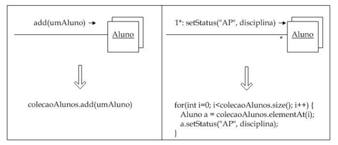
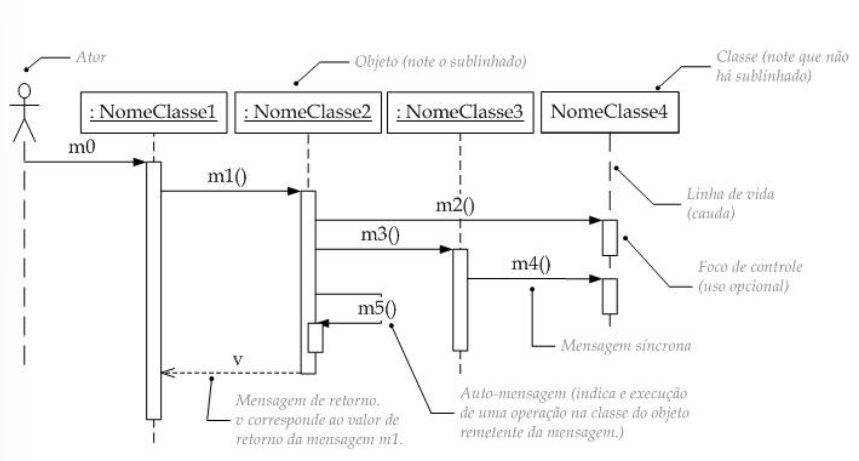
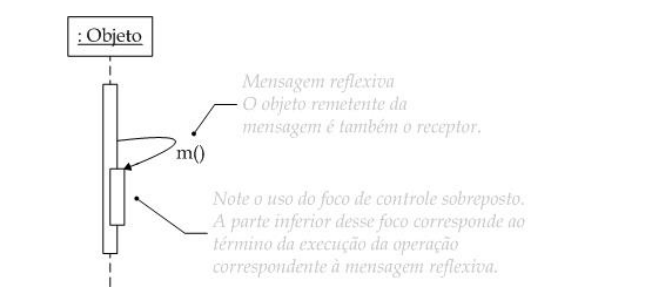
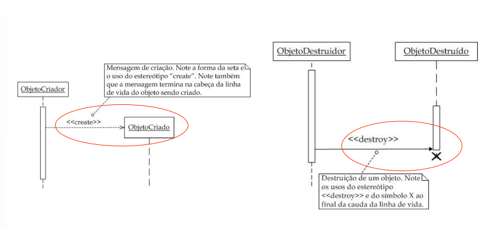
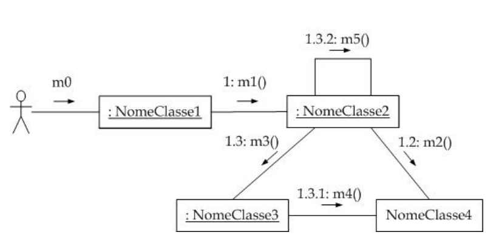
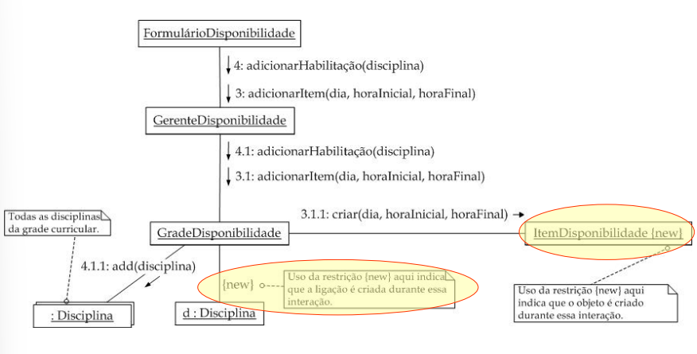
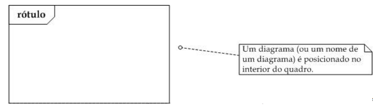
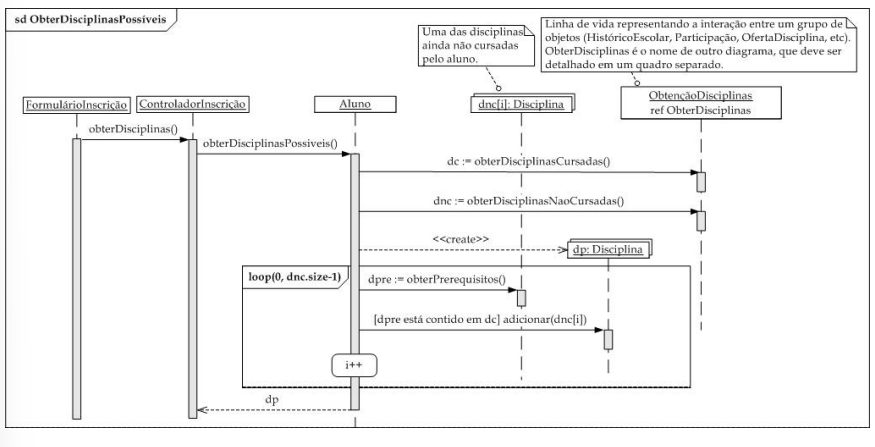
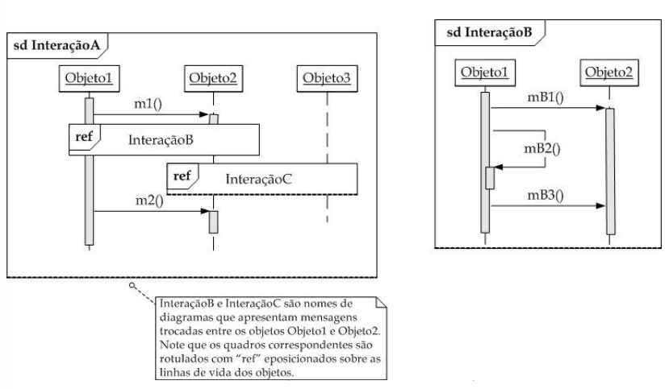

# RESUMO DOS CONCEITOS E ANOTAÇÕES

## ANÁLISE DE PROJETO

**Foco**: Definir a solução do problema relacionado ao SSOO.

Princípios de projeto adotado e alto detalhamento para que seja implementado.

### Principais atividades

1. Detalhamento dos aspectos dinâmicos do sistema.
2. Refinamento dos aspectos estáticos e estruturais do sistema.
3. Detalhamento da arquitetura do sistema.
4. Definição das estratégias (armazenamento, gerenciamento e persistência) de dados manipulados pelo sistema
5. Realização do projeto de interface gráfica com o usuário.
6. Definição dos algoritmos a serem implementados.

## MODELAGEM DE INTERAÇÕES

Representa mensagens trocadas entre objetos para que seja executado os caso de uso do sistema.

Seria como o sistema age internamente para que um ator consiga atingir seu objetivo em determinado caso de uso.

É formado por um conjunto de diagramas de interações.

### Mensagem

Sistema OO: Rede de objetos que trocam mensagens entre si, onde existe uma interação.

Quando enviar uma mensagem?

- Quando um objeto precisar de ajuda.
Quando um deseja que o segundo realize alguma tarefa.
    **Indica operações que classes devem ter.**

#### Mensagem x Responsabilidades

A presença na mensagem implica na existÊncia daquela operação no objeto receptor. A resposta que esse objeto da a classe, é a forma que ele executa a operação.

#### Estrutura para mensagens

[[expressão-sequencia]controle:][v:=]nome[(argumentos)]
'*' '['clausula-teracao']'  ou '['clausula-condicao']'
Termo obrigatório: **nome** da mensagem

| ordem: nomeDoMetodo(parâmetros)

ordem → indica a sequência do que acontece (1, 2, 3…)
nomeDoMetodo → ação que está sendo chamada
parâmetros → dados enviados para essa ação.

| Símbolo / Sintaxe | Significado | Explicação prática |
|------------------|-------------|--------------------|
| `1:` | Ordem da execução | Indica a sequência da mensagem no fluxo do sistema |
| `objeto.metodo()` | Ação | Chamada de método em um objeto (execução de uma função) |
| `[condição]` | Condição | Só executa a mensagem se a condição for verdadeira |
| `*` | Repetição | Indica que a ação se repete várias vezes |
| `i := 1..n` | Loop com limite | Iteração de i de 1 até n |
| `x :=` | Guarda retorno | Armazena o resultado de uma operação em uma variável |

### Notação para objetos

- Mesma notação do diagrama de objetos, com objetos `anônimos` ou `nomeados`.
- Escrito sublinhado.

objeto nomeado: <u>umaDisciplina: Disciplina</u>

objeto anônimo: <u>Disciplina</u>

objeto em uma coleção: <u>preRequisitos[i]:Disciplina</u>

### Multiplos Objetos

- Coleção de objetos de uma mesma classe
- Símbobo: Dois retângulos sobrepostos

1. Exemplo

Como ler:
    Quadro 1 -> Adiciona um aluno na coleçãõ alunos
    Quadro 2-> Realizar a operação setStatus para cada objeto na coleção

#### Implementação

```java
public interface List<E> extends Collection<E> {
    E get(int index);
    E set(int index, E element);
    boolean add(E element);
    void add(int index, E element);
    E remove(int index);
    abstract boolean addAll(int index, Collection<? extends E> c);
    int indexOf(Object o);
    int lastIndexOf(Object o);
    ListIterator<E> listIterator();
    ListIterator<E> listIterator(int index);
    List<E> subList(int from, int to);
}

```

Tipos de diagrmaa de interação

1. Diagrama de Sequencia: Mensagens enviadas no decorrer do tempo
2. Diagrama de comunicação: Mensagens enviadas entre objetos relacionados
3. Diagrama de visão geral de interação: Interação entre objetos

## DIAGRAMA DE SEQUÊNCIA

Foco: Demonstrar como as mensagens estão sendo enviadas, recebidas e gerenciadas ao longo da sua linha de vida

- Elementos: Atores, objetos, classes, mensagens , linha de vida, iteração, criação/destruição de objetos


- Mensagens reflexivas: auto-mensagem


- Criação / Destruição de objetos: <<create>> ou <<destroy>>


## DIAGRAMA DE COMUNICAÇÃO

Ou diagrama de **colaboração**, demonstra as relações e o sentido da seta é o da mensagem
- Ligações -> relacionamentos
- Elementos basicos: atores, objetos, mensagens, criação/destruição, iterações


Tags usadas: 
- {new}: objetos ou ligações criados durante a interação
- {destroyed}: objetos ou ligações destruídos durante a interação
- {transient}: objetos ou ligações destruídos e criados durante a
interação



## MODULARIZAÇÃO DE INTERAÇÕES

- Quadros de Interação: quadro que modulariza os diagramas, tem como objetivo referenciar um diagrama separadamente


- Diagramas nomeados: Nomear diagramas dentro do quadro


- Diagramas de referência: Fazer referencia a um diagrama definido 


## CONSTRUÇÃO DO MODELO DE INTERAÇÕES

